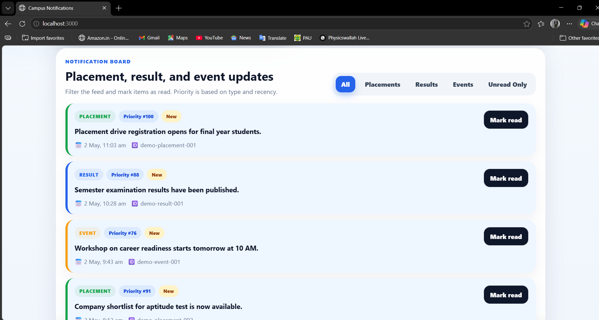

# Campus Notifications Microservice

This repository contains the campus notifications assessment project. It is split into two parts: a priority inbox design in Stage 1 and a React frontend in Stage 2.

## What’s Inside

- **Stage 1**: Priority inbox logic and design notes
- **Stage 2**: Responsive React frontend
- **Shared docs**: Setup, guidelines, and submission notes- **screenshots/**: Working app in action
## Project Layout

```
afford_medial_tech/
├── README.md
├── CONTRIBUTING.md
├── notification_system_design.md
├── Stage_1/
├── Stage_2/
├── screenshots/           ← Live app screenshots
└── .dist/
```

## Stage Summary

### Stage 1
Build the backend logic for a priority inbox that ranks notifications by type and recency. The goal is to keep the top 10 unread items ready at all times.

### Stage 2
Build the frontend in React with Material UI. It should show all notifications, highlight priority items, filter by type, and work well on both desktop and mobile.

## API Used

The app reads notifications from:

```text
http://20.207.122.201/evaluation-service/notifications
```

Supported query parameters:
- `limit`
- `page`
- `notification_type`

Supported notification types:
- `Event`
- `Result`
- `Placement`

## Setup

### Stage 1
```bash
cd Stage_1
```

### Stage 2
```bash
cd Stage_2/frontend
npm install
npm run dev
```

The frontend runs on `http://localhost:3000`.

## Working Notes

- Use the provided API instead of hard-coded data.
- Keep the code production-ready and readable.
- Add screenshots once the implementation is working.
- Push changes to GitHub regularly.

## Submission Checklist

- Working code is committed and pushed
- Stage 1 design notes are complete
- Stage 2 frontend runs locally
- Screenshots are included

## Screenshots

The `screenshots/` folder contains evidence of the working application:

- **dashboard-overview.png** — Priority inbox with stats and top ranked notifications
- **notification-feed.png** — Full notification board with filters and read status actions




Screenshots show the app running on `localhost:3000` with demo notifications. See [screenshots/README.md](screenshots/README.md) for details.

## License

Campus Notifications Project - 2026

---

**Last Updated**: May 2, 2026
**Project Version**: 1.0.0
